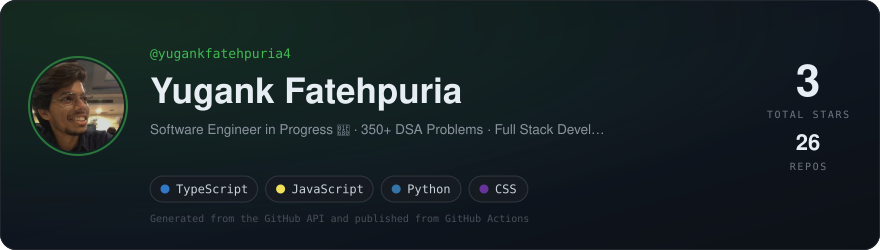
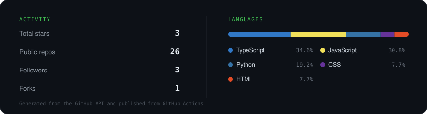

 

---

## About

B.Tech CSE @ **IIIT Sonipat '27**, building full-stack and GenAI products.
Most recently a Frontend Development Intern at **NIC, New Delhi**, where I shipped
**10+ enterprise dashboards** for the Government of India's Parichay portal.

- Currently going deep on **agentic AI**, LLM apps and real-time systems
- **350+ DSA problems** solved, and still counting
- Open to **SDE roles · Placements 2027**
- Off the clock: a Triumph Speed T4 and empty highways outside Jaipur

---

## Tech

---

## Selected work

| Project | What it does | Built with |
| --- | --- | --- |
| **[HackForge](https://github.com/yugankfatehpuria4/HackForge)** | Turns plain-English ideas into production-ready code with Gemini — cut prototype coding time ~40% | Next.js · Gemini · TypeScript |
| **[ImpulseStopper](https://github.com/yugankfatehpuria4/ImpluseStoppr)** | Impulse-shopping deterrent with spending analytics and an AI "therapist" before checkout | React · TypeScript · Recharts |
| **[LetsMeet](https://github.com/yugankfatehpuria4/LetsMeet)** | P2P video meetings, ~40% less server bandwidth, JWT rooms connecting in <150ms | WebRTC · React · Node.js |
| **[Multiplayer Chess](https://github.com/yugankfatehpuria4/Chess_Game)** | 100+ concurrent matches under 200ms latency | Socket.IO · Express · Chess.js |
| **[CarbonTrackr](https://github.com/yugankfatehpuria4/CarbonTrackr)** | Daily CO₂ footprint tracking in under two minutes | React · Chart.js · Vite |

---

## Stats

 

---

## Contribution graph

<picture>
  <source media="(prefers-color-scheme: dark)" srcset="https://raw.githubusercontent.com/yugankfatehpuria4/yugankfatehpuria4/output/snake-dark.svg">
  <source media="(prefers-color-scheme: light)" srcset="https://raw.githubusercontent.com/yugankfatehpuria4/yugankfatehpuria4/output/snake.svg">
  
</picture>

Generated from the contribution graph and published from GitHub Actions

---

**Let's build something worth shipping.**

[yugankfatehpuria786@gmail.com](mailto:yugankfatehpuria786@gmail.com) · [Portfolio](https://my-portfolio-iota-ebon-33.vercel.app/) · Jaipur, India

